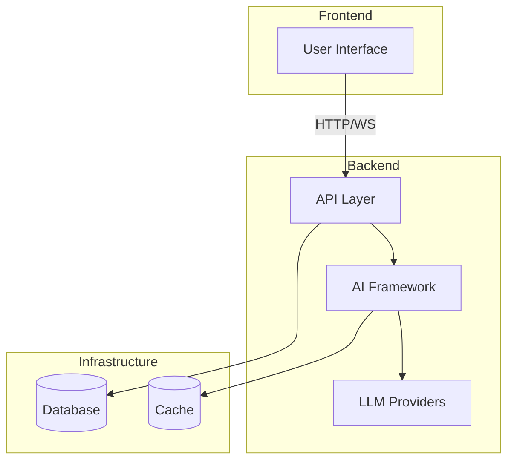

# AI-SDK-OPENAI

[](https://github.com/mk-knight23/AI-SDK-ECOSYSTEM)
[](https://openai.com/)
[](https://angular.io/)
[](https://go.dev/)

> **Framework**: OpenAI SDK (Assistants API & GPT-4o)
> **Stack**: Angular 19 + Go Fiber

---

## 🎯 Project Overview

**AI-SDK-OPENAI** showcases the OpenAI Assistants API with GPT-4o integration. It demonstrates function calling, code interpretation, file uploads, and real-time streaming for building production AI applications.

### Key Features

- 🤖 **Assistants API** - OpenAI's managed agent framework
- 🧩 **Function Calling** - Tool use and API integration
- 📁 **File Uploads** - Document analysis and RAG
- 💬 **Real-time Streaming** - Live response generation
- 🔍 **Code Interpreter** - Safe code execution environment

---

## 🛠 Tech Stack

| Technology | Purpose |
|-------------|---------|
| Angular 19 | Frontend framework |
| Go Fiber | Backend API |
| OpenAI SDK | LLM integration |
| Angular Material | UI components |
| WebSocket | Real-time updates |

---

## 🚀 Quick Start

```bash
# Frontend
cd frontend && npm install && ng serve

# Backend
cd backend && go run main.go
```

---

## 🔌 API Integrations

| Provider | Usage |
|----------|-------|
| OpenAI | Primary (Assistants, GPT-4o) |
| Azure OpenAI | Enterprise fallback |

---

## 📦 Deployment

**Google Cloud Run**

```bash
gcloud run deploy
```

---

## 📁 Project Structure

```
AI-SDK-SDK-OPENAI/
├── frontend/         # Angular application
├── backend/          # Go Fiber API
└── README.md
```

---

## 📝 License

MIT License - see [LICENSE](LICENSE) for details.

---


---

## 🏗️ Architecture



---

## 📡 API Endpoints

| Method | Endpoint | Description |
|--------|----------|-------------|
| GET | /health | Health check |
| POST | /api/execute | Execute agent workflow |
| WS | /api/stream | WebSocket streaming |

---

## 🔧 Troubleshooting

### Common Issues

**Connection refused**
- Ensure backend is running
- Check port availability

**Authentication failures**
- Verify API keys in `.env`
- Check environment variables

**Rate limiting**
- Implement exponential backoff
- Reduce request frequency

---

## 📚 Additional Documentation

- [API Reference](docs/API.md) - Complete API documentation
- [Deployment Guide](docs/DEPLOYMENT.md) - Platform-specific deployment
- [Testing Guide](docs/TESTING.md) - Testing strategies and coverage
---


**Part of the [AI-SDK Ecosystem](https://github.com/mk-knight23/AI-SDK-ECOSYSTEM)**
